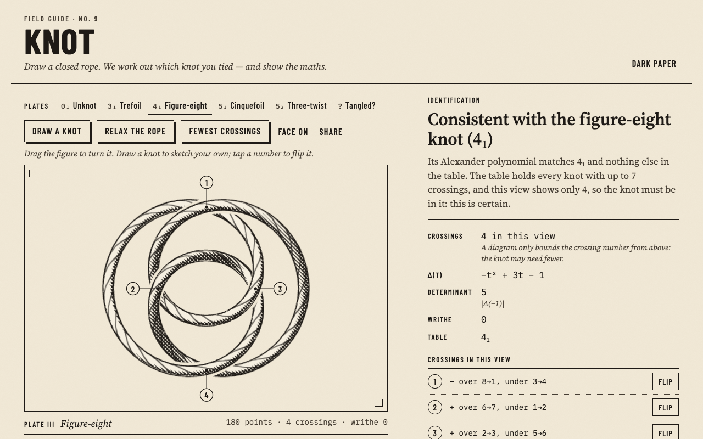

# knot

Draw a closed rope in 3D; the app works out which knot you tied, and shows the maths.

**Live:** https://knot-e6b.pages.dev



It looks like a page from a climbing manual: cream paper, an ink-outlined rope with cross-hatched shading and a laid-rope texture, crossings numbered like a figure's callouts, and one red mark for the crossing in hand. Dark paper with light ink is the same illustration.

## The 30-second experience

The tools sit above the figure, with a one-line how-to, so the first drag on the page turns the rope rather than surprising anyone.

1. **Draw.** Press *Draw a knot* and drag one loop that crosses itself. Let go and the ends join. The crossings are found and set to alternate over and under (the classic default: an alternating drawing is knotted whenever it can be).
2. **Choose.** Tap a numbered crossing (or its *Flip* button) to swap which strand goes over. The verdict updates at once. After every flip the page reads the diagram again from the same view and refuses the flip, with a message, unless exactly that one crossing changed.
3. **Turn and relax.** Drag the figure, or use the arrow keys, to turn it: the crossings and their numbers change as you turn, the polynomial never does. *Relax the rope* lets it settle into an open shape without ever passing through itself, scales it back to the size it started at, then turns to the view with the fewest crossings it can find.

Or pick a plate: the unknot, trefoil (3₁), figure-eight (4₁), cinquefoil (5₁), three-twist knot (5₂), and a "tangled" loop with eleven crossings that is really the unknot.

The headline says what the rope is consistent with, never more: *"Consistent with the figure-eight knot (4₁)"*. When several table knots share the polynomial (the granny and square knots), it lists them all. The line under it says how sure that is. A view with at most 7 crossings shows a knot with at most 7 crossings, and the table holds every such knot, so a single match there is certain up to mirror image. Δ = 1 on a view with at most 10 crossings is certainly the unknot, because the smallest other knots with Δ = 1 have 11. Beyond those, a match is evidence, not proof. *Show the working* opens the full calculation: the crossings with their signs, the planar diagram (PD) code, the arcs, the Alexander matrix, the exact determinant, the normalisation, and the table lookup.

## How it works

Everything that decides anything is plain TypeScript in `src/topology/`, independent of rendering and unit-tested:

| Step | File | What it does |
|---|---|---|
| Drawing → rope | `lift.ts` | Cleans, closes, resamples and smooths the stroke; finds its self-crossings; lifts the over-strand and lowers the under-strand in a small bump around each crossing. Each bump covers a stretch of rope with no other crossing, so the rope is always valid. Flipping a crossing re-uses the same bump on an existing 3D rope; a segment that crosses a bump's edge and carries another crossing is cut at the edge first (otherwise that crossing's depth would be dragged along), and the result is re-read and refused unless exactly one crossing changed sign. |
| Crossings | `crossings.ts` | Projects the rope onto the view plane, finds every self-intersection of its shadow, reads over/under from depth, numbers crossings in the order the rope reaches them, computes each sign, and labels the 2n edges for the PD code (KnotTheory / Knot Atlas convention). This part is floating point, with safeguards: tolerances, and exactly degenerate views are nudged by a fraction of a milliradian and reported. |
| Alexander polynomial | `alexander.ts`, `poly.ts` | Builds the n × n Alexander matrix from the PD code (1 − t for the over-arc, t and −1 for the under-arcs on the over-strand's right and left), deletes a row and column, and takes the determinant by fraction-free (Bareiss) elimination over integer polynomials with `BigInt` coefficients. Normalises to lowest power t⁰ and Δ(1) = 1. No floating point touches a coefficient. |
| Identification | `identify.ts`, `table.ts` | Compares Δ(t) with every knot up to 7 crossings and words the result honestly (see *Honest limitations*). |
| Relaxation | `relax.ts` | Springs, bending, a weak 1/r² repulsion and a thick-rope contact push. Every point's move is clamped to 0.45 × the current smallest gap between non-neighbouring segments; moving every point less than half that gap along a straight line cannot make the rope pass through itself, so the knot type provably cannot change. At most 600 steps. The rope stretches as it opens out, so the result is scaled back to its starting bounding radius (a similarity, which cannot change the knot); without that, pressing *Relax* again and again grew the rope without limit. |
| Views | `analyse.ts` | The whole pipeline, plus a search over 65 view directions for the fewest crossings (ties go to the view whose crossings are furthest apart). While the figure is being dragged, views with more than 40 crossings skip the polynomial (it is the same from every view) and it is worked out again on release. |
| Share links | `share.ts` | The rope's points (on a 0.01 grid, delta-encoded varints, base64url) and the view rotation in the URL fragment. The page snaps rope and view to that grid before analysing, so a link reproduces exactly what the sender saw. Snapping moves each point less than 0.009 units and is only done when the rope's smallest gap is more than twice that. |

The page (`src/app/`) draws the rope with three.js: a `TubeGeometry` along a closed Catmull-Rom curve, a custom shader for toon shading, screen-space cross-hatching and the rope's lay, and two back-face hulls — an ink outline, and a paper-coloured halo that breaks the strand passing underneath, like a printed knot diagram. The curve runs through extra points laid along each straight segment of the analysed polygon, so the drawn rope follows that polygon (only its corners are rounded) and the crossing dots sit on the drawn crossings, even for a sparse 8-point rope from a link. The halo shrinks where the rope tilts towards the viewer, so a steep strand doesn't cut gaps into itself. The camera is orthographic, so the still picture is exactly the projection that is analysed. The gentle idle sway (±5°, off under reduced motion and after the first drag) is decoration only: the analysis always uses the still view, and the sway pauses while *Show the working* is open. Crossing labels are placed on clear paper with leader lines; crowded crossings choose first and no two labels overlap. Without WebGL 2 (or with `?flat` in the URL) it falls back to a flat SVG drawing and the maths is unchanged.

### The knot table

Every prime knot with up to 7 crossings (0₁, 3₁, 4₁, 5₁, 5₂, 6₁–6₃, 7₁–7₇), plus the composite granny knot, square knot and 3₁ # 4₁ (Δ of a connected sum is the product). Mirror images are not listed separately because the Alexander polynomial cannot tell them apart.

- Source: D. Rolfsen, *Knots and Links* (1976), Appendix C, as reproduced in the [Knot Atlas](https://katlas.org/wiki/The_Rolfsen_Knot_Table), checked 2026-09-26.
- See also: C. Livingston and A. H. Moore, *KnotInfo: Table of Knot Invariants*, knotinfo.org, September 26, 2026 (the citation form KnotInfo asks for). KnotInfo is a standard reference; its data was not consulted for these values.
- The polynomials are mathematical facts, typed in by hand. Neither the Knot Atlas nor KnotInfo publishes a data licence, so nothing was copied into the site beyond those facts, and both are cited. `tests/unit/alexander.test.ts` quotes the Knot Atlas PD codes (with attribution) and recomputes every table polynomial from them with this project's own code.

## Why TypeScript

The heart of the app is an exact, deterministic topology pipeline that has to run in the browser, fast, on every drag. TypeScript with strict types keeps the geometry (`Float64Array` curves) and the algebra (`BigInt` polynomials) honest, and the same modules run unchanged under Node's test runner. three.js (pinned, `0.186.1`) does only the drawing.

## Build and test

Needs Node 22.18 or later (the tests run TypeScript directly with Node's built-in type stripping) and Google Chrome for the browser checks (set `CHROME_PATH` if it isn't in the usual place).

```sh
npm ci
npm run build      # → dist/ (hashed JS/CSS, index.html, _headers, THIRD-PARTY-NOTICES.txt)
npm test           # typecheck + unit tests + build + headless-Chrome end-to-end checks
npm run serve      # serve dist/ locally with the production headers (random free port)
```

- **Unit tests** (`node:test`, `tests/unit/`): crossing extraction on constructed curves (including degenerate and self-intersecting ones), PD codes for every preset, Alexander polynomials against known values with normalisation, every table row recomputed from Knot Atlas PD codes, mirror images, Bareiss vs cofactor expansion, identification of every preset (the tangled one as the unknot), granny/square listed together, 9₁ reported as not in the table, relaxation never changing Δ and never moving a point more than half the gap, twelve relaxes in a row keeping the rope's size (and its link), drawing, flipping (every flip of every plate from four views, relaxed or not, changes exactly one crossing; a result that changes more is refused), the wording rules for certain and uncertain matches, the drawn tube following a sparse polygon, the view search reporting the starting view's crossings as the page shows them, and share-link round trips plus hostile links.
- **End-to-end** (`tests/e2e/`, headless Chrome over the DevTools protocol): no console errors, a WebGL 2 context that actually draws ink, every plate identified, drawing a trefoil with the mouse, flipping a crossing from the figure and from the list, relaxing, sharing and reopening the link, turning with the keyboard, hostile links (200 000 characters, garbage, a valid rope with 164 crossings) refused or bounded with the reason visibly on screen, flipping each crossing of a turned cinquefoil changing only that crossing, twelve relaxes then Share, dragging a 99-crossing rope with the polynomial deferred until release, the tools and figure above the fold at 1280×800, the sway pausing while the working is open, "1 crossing" in the singular, no overlapping labels on a dense drawing (before and after turning it), crossing dots on the drawn rope for a sparse link, a true 400 px phone width with no sideways scroll, a second finger on a phone neither restarting a drawing nor spinning the figure, reduced motion, the flat fallback, the notices file and the cache headers.

## Running on Cloudflare (free)

It is a static site: `dist/` deploys to Cloudflare Pages, which serves static files free with unlimited requests (limits as of 2026-09-25: 20 000 files per site, 25 MiB per file; this site is seven files, the largest about 590 KiB). There is no Worker and no server logic; nothing is stored anywhere.

```sh
npx wrangler pages deploy dist --project-name knot
```

That is the plain command for anyone deploying their own copy. The owner deploys only through a guarded deploy script, which refuses unless the project's own Cloudflare account is configured; the repo has no deploy script of its own.

`_headers` sets a strict Content-Security-Policy (scripts only from the site itself, fonts from Google Fonts), `no-cache` on the page, and a year-long immutable cache only on the content-hashed files in `/assets/`.

## Honest limitations

- **"Consistent with", not "is".** The Alexander polynomial cannot tell a knot from its mirror image, and knots with more crossings can share a polynomial with a small one (for example, some knots with 11 or more crossings have Δ = 1, like the unknot). The headline always says "consistent with". The detail line says "certain" only where the diagram settles it: fewer than three crossings (always the unknot), a single table match on a view with at most 7 crossings (certain up to mirror image), and Δ = 1 on a view with at most 10 crossings. Those rest on the standard knot tables being complete up to those sizes.
- **Only the polynomial is exact.** The Alexander polynomial is computed with exact integer arithmetic. Finding the crossings is floating-point geometry with safeguards (tolerances, and a tiny turn of the view when a corner lands exactly on another strand's shadow).
- **A diagram's crossing count is an upper bound.** The "fewest crossings" search tries 65 directions; it is not guaranteed to find the knot's true crossing number.
- **Relaxation does not always untangle.** It is guaranteed never to change the knot, but it can settle in a shape that still has extra crossings: the tangled plate goes from 11 crossings to 7, not to 0. The polynomial is what reveals it is the unknot. The rope stretches as it opens out (up to about 40%), so the result is scaled back to its starting size; its length after that can drift down a little over many presses, and strands can sit a little closer.
- **Beyond 7 crossings the table says "not in our table".** Names for bigger knots need a larger table.
- **Drawing is pointer or touch only.** Keyboard users can load the plates, turn the figure with the arrow keys, flip crossings from the list, relax, and share.
- **Limits.** Strokes are read up to 6 000 points and resampled to at most 280; a drawing may have up to 30 crossings; a rope has at most 480 points (a flip that would need more is refused); the polynomial is computed for up to 100 crossings (above that the page says so), and while dragging only up to 40; a share link is read only up to 8 192 characters, and a rope that can't be put in a link says so instead of failing.
- **Labels on very dense views.** Labels never overlap, but on views with many crossings some sit well away from their crossing on long leader lines. Above 60 crossings they are hidden and the list is used instead.
- The fonts load from Google Fonts; without them the page falls back to system faces.

## Next

- The Jones polynomial via the Kauffman bracket (it would tell the trefoil from its mirror image and the granny from the square knot).
- A larger knot table (8–10 crossings, from KnotInfo, with its licence checked).
- Export for 3D printing (a watertight tube mesh).
- A smarter tightening pass (ideal-knot style) that simplifies tangled unknots more often.

## Third-party notices

`dist/THIRD-PARTY-NOTICES.txt` (linked from the page's colophon) lists three.js 0.186.1 with its MIT licence text, the three Google Fonts (SIL Open Font License 1.1), and the sources of the knot table data. It is generated by the build and checked by the tests.

## Credits

Built by Ramen Protocol with AI assistance (Claude). MIT licence — see `LICENSE`.
